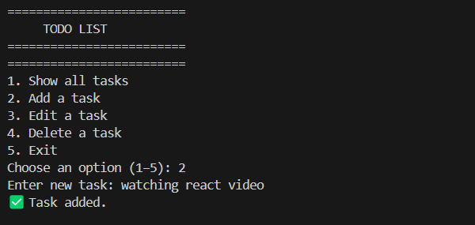
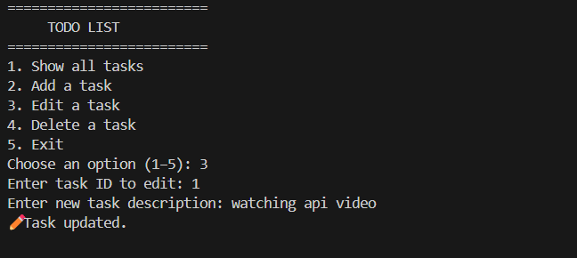
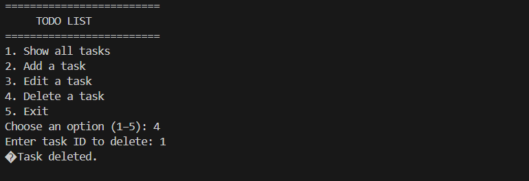
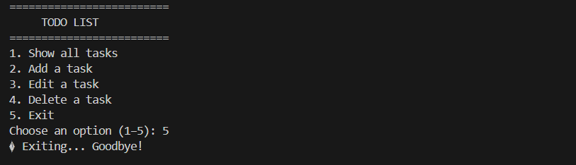

# ✅ Terminal Todo List App (TypeScript)

This is a simple interactive **Todo List application** built using **TypeScript** that runs entirely in the terminal (console).  
Users can **add**, **edit**, **delete**, and **view tasks** from a text-based menu.

---

## 🛠 Features

- 📋 View all tasks
- ➕ Add a task
- ✏️ Edit a task
- 🗑️ Delete a task
- 🚪 Exit the menu

No GUI or browser is required — everything works directly in the terminal.

---

## 📸 Screenshots

### 🏁 Main Menu

  
*The main menu shows all available options: Show, Add, Edit, Delete, Exit.*

---

### ➕ Add Task

  
*User is prompted to enter a new task.*

---

### 📝 Show Tasks

  
*Displays all tasks with their IDs.*

---

### ✏️ Edit Task

  
*User can edit an existing task using its ID.*

---

### 🗑️ Delete Task

  
*User deletes a task by entering its ID.*

---

### ✅ EXIT

  
*The user chooses option 5 to exit the program. A goodbye message is shown.*

---

## 📦 Installation and Running

### 1. Clone the Repository

```bash
git clone https://github.com/nebutty/TO_DOLIST_TYPESCRIPT.git
cd TO_DOLIST_TYPESCRIPT
