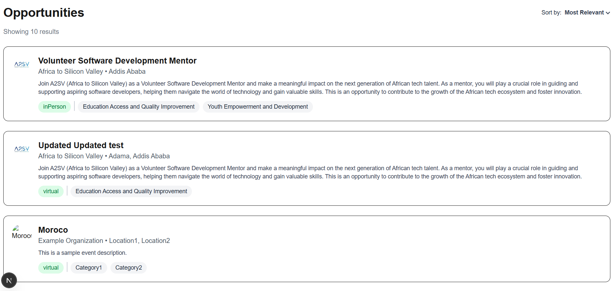
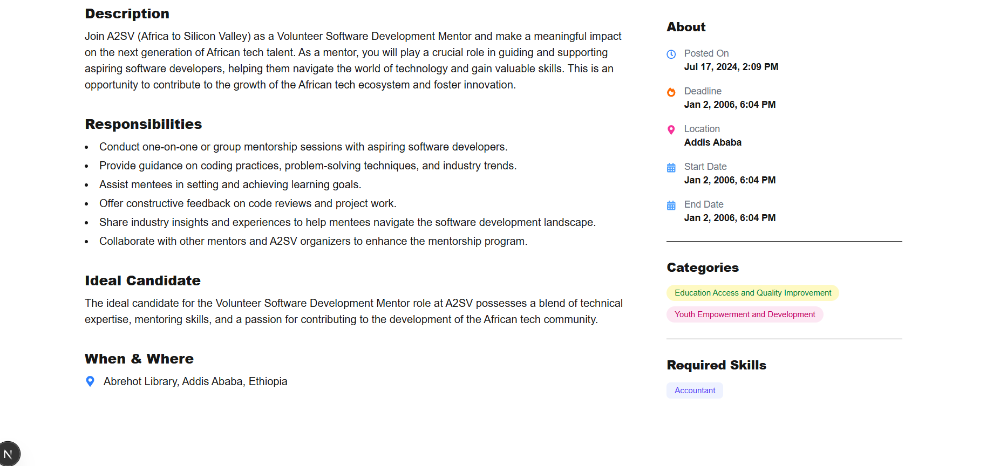
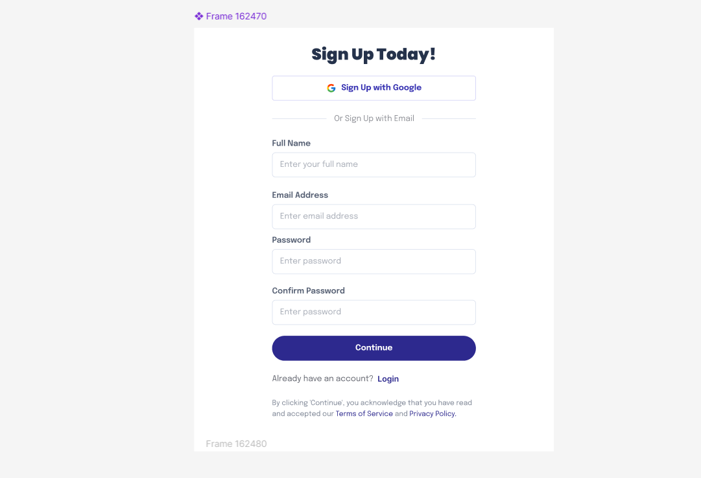
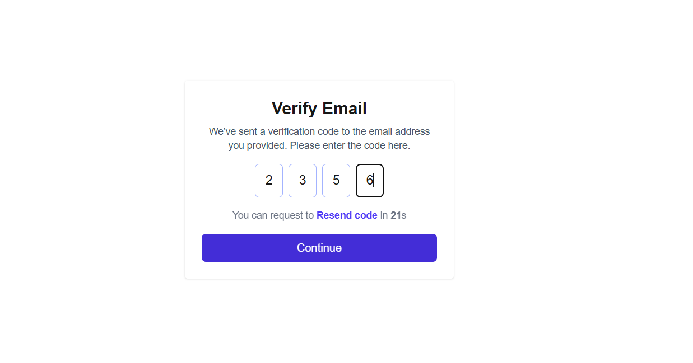
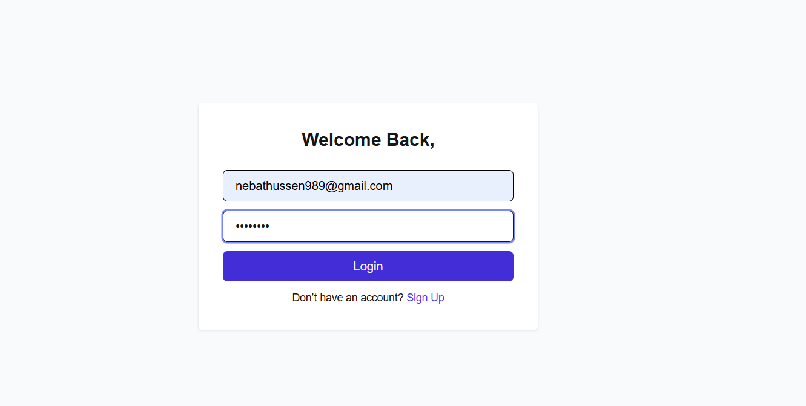
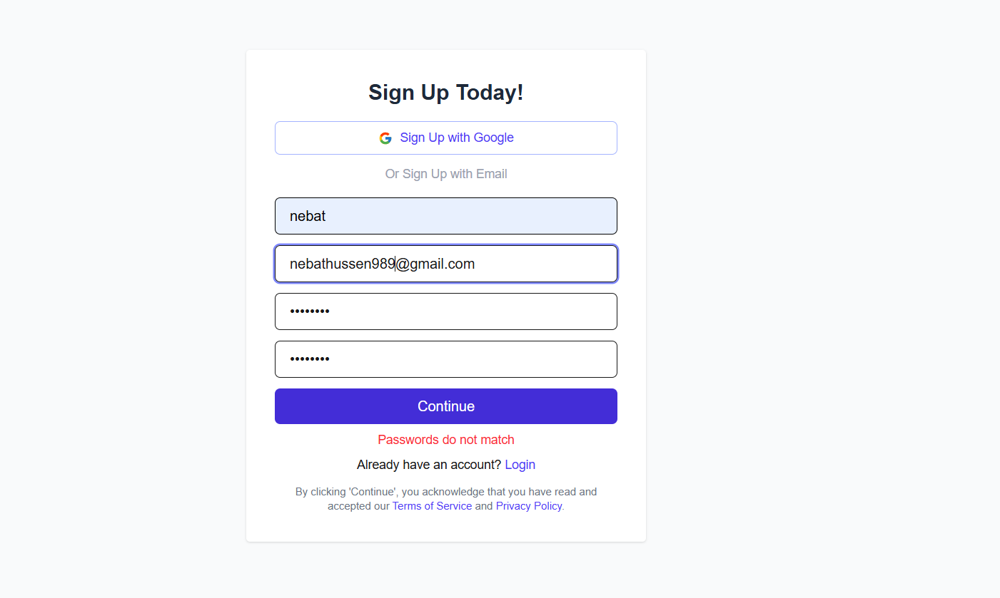
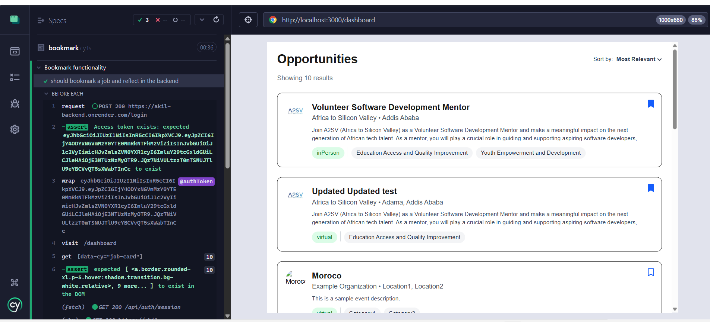
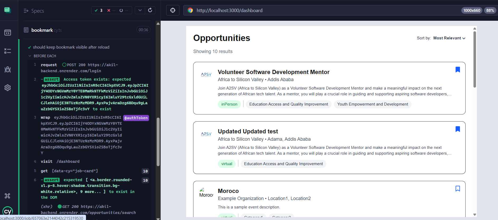
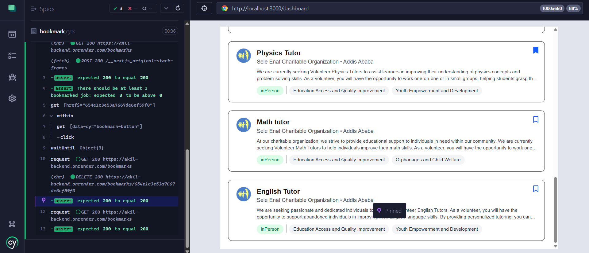
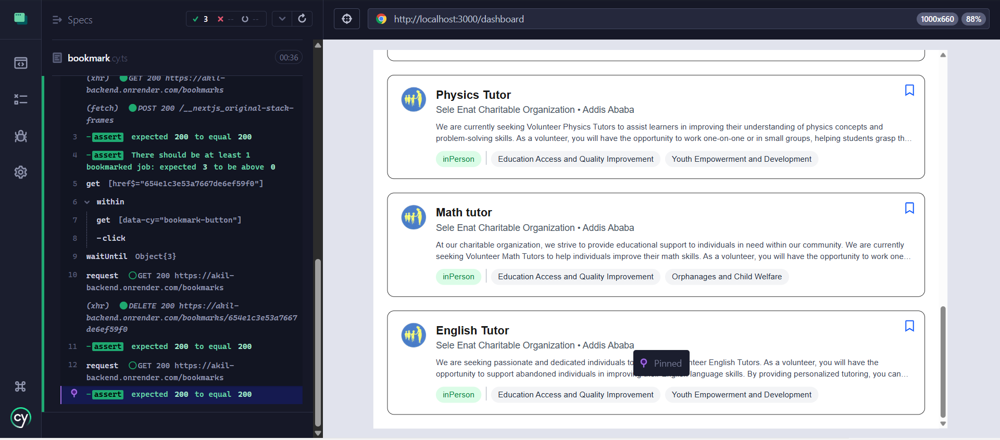

# 🧭 Job Listing App

This is a modern job listing application built with **Next.js 14**, **React**, **Tailwind CSS**, and **Redux Toolkit**. It allows users to browse available job opportunities and view detailed descriptions.

## 🚀 Features

- ✅ Job listings fetched from a live API (`/opportunities` endpoint)
- ✅ Detailed job view with responsibilities, ideal candidate, and logistics
- ✅ Category and skill tags with color-coded badges
- ✅ Responsive design using Tailwind CSS
- ✅ State management using Redux Toolkit
- ✅ 🔐 User authentication with email verification and Google OAuth
- ✅ Testing using cypress and jest

## 📸 Screenshots

### 🏠 Home Page (Job Listings)
> _Displays a list of job cards with title, company, and category._



---

### 📄 Job Description Page
> _Shows detailed job information including responsibilities, ideal candidate, dates, and location._



---

### 🔐 Authentication Pages (Screenshots)
> _User authentication flow with validation and email OTP verification._

- **📝 Sign Up**
  

- **📧 Verify Email**
  

- **🔓 Sign In**
  

- **⚠️ Input Validation**
  

---
### Testing
### 1️⃣ **Bookmark a Job**
- Logs in via backend API.
- Visits the dashboard and bookmarks the first job card.
- Confirms via `GET /bookmarks` that the job ID is stored in the backend.

**Screenshot:**  


---

### 2️⃣ **Keep Bookmark Visible After Reload**
- Reloads the dashboard page.
- Checks that the bookmark icon for the previously bookmarked job remains visible after refresh.

**Screenshot:**  


---

### 3️⃣ **Remove (Unbookmark) a Job**
- Ensures a job is currently bookmarked (verified via backend API).
- Clicks the bookmark button to unbookmark it.
- Polls `GET /bookmarks` until the job ID is no longer present in the backend.

**Screenshots:**
- _When Marked:_  
  
- _After Unmarked:_  
  
## ▶️ Running Tests

### Run Cypress E2E Tests:
```bash
npx cypress open
## ⚙️ Tech Stack

- **Framework**: [Next.js](https://nextjs.org/)
- **Styling**: [Tailwind CSS](https://tailwindcss.com/)
- **State Management**: [Redux Toolkit](https://redux-toolkit.js.org/)
- **Data Fetching**: `axios`
- **Authentication**: Custom backend + NextAuth (for Google OAuth)

---

## 🔐 User Authentication

This app includes a secure user authentication system with full flow from registration to login.

### ✅ Sign Up
- Name, Email, Password, Confirm Password fields
- Form validation: required fields, email format, password match
- Sends OTP to email for verification
- Redirects to email verification page after signup

### 🔐 Email Verification
- User enters 4-digit OTP received via email
- Auto-focus between OTP input boxes
- Timer to resend OTP after 30 seconds
- Fails gracefully if OTP is incorrect

### 🔓 Sign In
- Email + password based login
- Redirects to dashboard after successful login
- Handles login failure with error messages

### 🌐 Google OAuth Login
- Uses NextAuth to allow Google-based login
- Redirects to dashboard on success

### 🚨 Input Validation
- Realtime client-side form validation:
  - Required fields
  - Valid email format
  - Password confirmation check

---

## 🛠️ Getting Started

1. Clone the repository:
   ```bash
   git clone https://github.com/nebutty/A2SV_WEBTRACK.git
   cd job-listing-app
